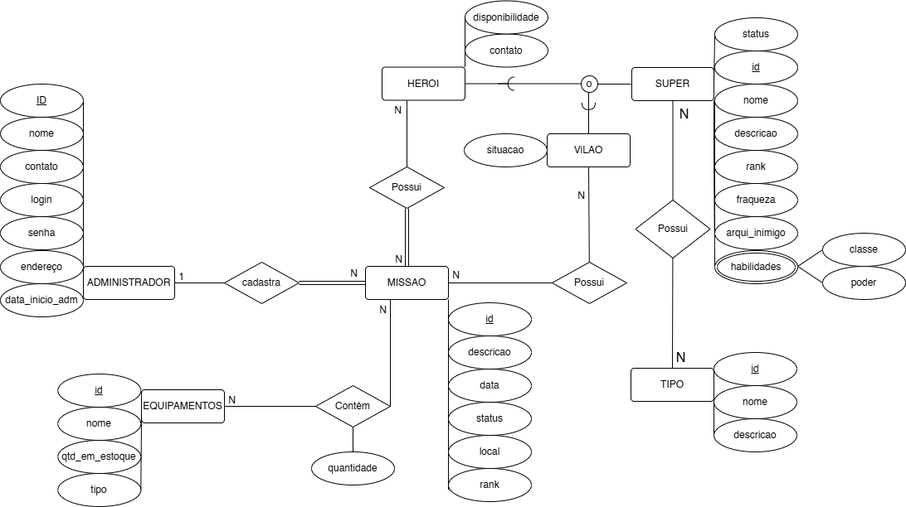
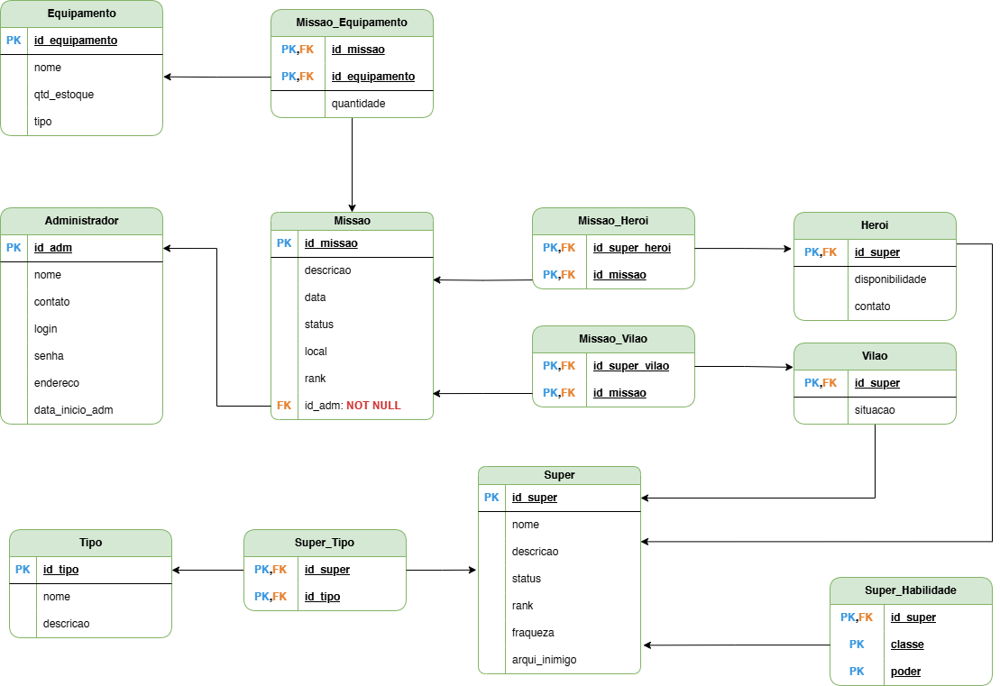

# Projeto de Banco de Dados
Este repositório contém o código destinado ao trabalho final da disciplina de Banco de Dados I.

## Descrição

O objetivo deste projeto é desenvolver um sistema de gerenciamento de heróis, utilizando um banco de dados relacional para armazenar informações sobre os heróis, missões e suas habilidades.

## Funcionalidades

| Funcionalidade                | Operação SQL   |
|-------------------------------|----------------|
| Adicionar um Administrador    | INSERT         |
| Remover um Administrador      | DELETE         |
| Atualizar um Administrador    | UPDATE         |
| Listar todos os Administradores | SELECT        |
| Adicionar um Herói            | INSERT         |
| Remover um Herói              | DELETE         |
| Atualizar um Herói            | UPDATE         |
| Listar todos os Heróis        | SELECT         |
| Adicionar uma Missão          | INSERT         |
| Remover uma Missão            | DELETE         |
| Atualizar uma Missão          | UPDATE         |
| Listar todas as Missões       | SELECT         |
| Adicionar uma Equipamento     | INSERT         |
| Remover uma Equipamento       | DELETE         |
| Atualizar uma Equipamento     | UPDATE         |
| Listar todas as Equipamentos  | SELECT         |
| Adicionar um Vilão            | INSERT         |
| Remover uma Vilão             | DELETE         |
| Atualizar uma Vilão           | UPDATE         |
| Listar todas as Vilão         | SELECT         |

## Tecnologias utilizadas

- Python
- PostgreSQL

## Como executar o projeto

### Inicializando o banco de dados

#### Para adicionar o banco de dados, siga os passos abaixo:

1. Certifique-se de ter o PostgreSQL instalado em seu sistema.
2. Abra o pgAdmin e crie um novo banco de dados chamado `hero_adm_system`
3. Em seguida, abra o query toll do banco de dados, adicione o arquivo `hero_adm_system.sql` disponível na raiz do projeto.
3. Execute o arquivo.
4. Adicione as credenciais do seu banco de dados no arquivo `.env`

### Inicializando o sistema

1. Clone este repositório
2. Instale as dependências utilizando o comando `pip install -r requirements.txt`
3. Execute o arquivo `main.py` para iniciar o sistema
4. Acesse o sistema através do terminal

## Modelagem do Banco de Dados

Nesta seção, apresentaremos a modelagem do banco de dados do sistema de gerenciamento de heróis. Serão abordados os requisitos de dados, o modelo de entidade relacionamento (MER) e o diagrama de entidade relacionamento (DER).

## Esquema Relacional

### Tabelas e seus Relacionamentos

#### Tabela: `administrador`
- **Campos:**
  - `id_adm` (PK, integer, NOT NULL) - Chave primária, gerada por uma sequência.
  - `nome` (character varying)
  - `contato` (character varying)
  - `login` (character varying)
  - `senha` (character varying)
  - `endereco` (character varying)
  - `data_inicio_adm` (date)
- **Relações:**
  - Relacionamento com a tabela `missao` (1:N), onde `id_adm` é a chave estrangeira em `missao`.

#### Tabela: `equipamento`
- **Campos:**
  - `id_equipamento` (PK, integer, NOT NULL) - Chave primária, gerada por uma sequência.
  - `nome` (character varying)
  - `qtd_estoque` (integer)
  - `tipo` (character varying)
- **Relações:**
  - Relacionamento com a tabela `missao_equipamento` (1:N), onde `id_equipamento` é a chave estrangeira.

#### Tabela: `heroi`
- **Campos:**
  - `id_super_heroi` (PK, bigint, NOT NULL) - Chave primária.
  - `disponibilidade` (character varying)
  - `contato` (character varying)
- **Relações:**
  - Relacionamento com a tabela `super` (1:1), onde `id_super_heroi` é uma chave estrangeira que referencia `id_super` da tabela `super`.
  - Relacionamento com a tabela `missao_heroi` (1:N), onde `id_super_heroi` é a chave estrangeira.

#### Tabela: `missao`
- **Campos:**
  - `id_missao` (PK, integer, NOT NULL) - Chave primária, gerada por uma sequência.
  - `descricao` (character varying)
  - `data` (date)
  - `status` (character varying)
  - `local` (character varying)
  - `rank` (character varying)
  - `id_adm` (FK, bigint, NOT NULL) - Chave estrangeira para `administrador`.
- **Relações:**
  - Relacionamento com as tabelas `missao_equipamento`, `missao_heroi`, e `missao_vilao` (1:N), onde `id_missao` é a chave estrangeira.

#### Tabela: `missao_equipamento`
- **Campos:**
  - `id_missao` (FK, bigint, NOT NULL) - Chave estrangeira para `missao`.
  - `id_equipamento` (FK, bigint, NOT NULL) - Chave estrangeira para `equipamento`.
  - `quantidade` (integer)
- **Relações:**
  - Relacionamento com `missao` e `equipamento` (M:N), representado por essa tabela de junção.

#### Tabela: `missao_heroi`
- **Campos:**
  - `id_super_heroi` (FK, bigint, NOT NULL) - Chave estrangeira para `heroi`.
  - `id_missao` (FK, bigint, NOT NULL) - Chave estrangeira para `missao`.
- **Relações:**
  - Relacionamento com `missao` e `heroi` (M:N), representado por essa tabela de junção.

#### Tabela: `missao_vilao`
- **Campos:**
  - `id_missao` (FK, bigint, NOT NULL) - Chave estrangeira para `missao`.
  - `id_super_vilao` (FK, bigint, NOT NULL) - Chave estrangeira para `vilao`.
- **Relações:**
  - Relacionamento com `missao` e `vilao` (M:N), representado por essa tabela de junção.

#### Tabela: `super`
- **Campos:**
  - `id_super` (PK, integer, NOT NULL) - Chave primária, gerada por uma sequência.
  - `nome` (character varying)
  - `descricao` (character varying)
  - `status` (character varying)
  - `rank` (character varying)
  - `fraqueza` (character varying)
  - `arqui_inimigo` (character varying)
- **Relações:**
  - Relacionamento 1:1 com `heroi` e `vilao` (herdado através de views `super_heroi` e `super_vilao`).
  - Relacionamento com `super_habilidade` e `super_tipo` (1:N).

#### Tabela: `super_habilidade`
- **Campos:**
  - `id_super` (FK, bigint, NOT NULL) - Chave estrangeira para `super`.
  - `classe` (character varying, NOT NULL)
  - `poder` (character varying, NOT NULL)
- **Relações:**
  - Relacionamento com `super` (M:N), representado por essa tabela de junção.

#### Tabela: `super_tipo`
- **Campos:**
  - `id_super` (FK, bigint, NOT NULL) - Chave estrangeira para `super`.
  - `id_tipo` (FK, bigint, NOT NULL) - Chave estrangeira para `tipo`.
- **Relações:**
  - Relacionamento com `super` e `tipo` (M:N), representado por essa tabela de junção.

#### Tabela: `tipo`
- **Campos:**
  - `id_tipo` (PK, integer, NOT NULL) - Chave primária, gerada por uma sequência.
  - `nome` (character varying)
  - `descricao` (character varying)
- **Relações:**
  - Relacionamento com `super_tipo` (1:N), onde `id_tipo` é a chave estrangeira.

#### Tabela: `vilao`
- **Campos:**
  - `id_super_vilao` (PK, bigint, NOT NULL) - Chave primária.
  - `situacao` (character varying)
- **Relações:**
  - Relacionamento com `super` (1:1), onde `id_super_vilao` é uma chave estrangeira que referencia `id_super` da tabela `super`.
  - Relacionamento com `missao_vilao` (1:N), onde `id_super_vilao` é a chave estrangeira.

### Views

#### View: `super_heroi`
- Combina dados de `super` e `heroi` para apresentar detalhes de super-heróis.

#### View: `super_vilao`
- Combina dados de `super` e `vilao` para apresentar detalhes de super-vilões.

### Modelo de Entidade Relacionamento (MER)

O modelo de entidade relacionamento (MER) é uma representação visual das entidades, atributos e relacionamentos do sistema. Com base nos requisitos de dados, criamos o seguinte MER:

### Diagrama de Entidade Relacionamento (DER)

O diagrama de entidade relacionamento (DER) é uma representação visual do modelo de entidade relacionamento (MER). Com base no MER apresentado anteriormente, criamos o seguinte DER:

## Licença
Este projeto está licenciado sob os termos da [Licença GPL-3.0](LICENSE).